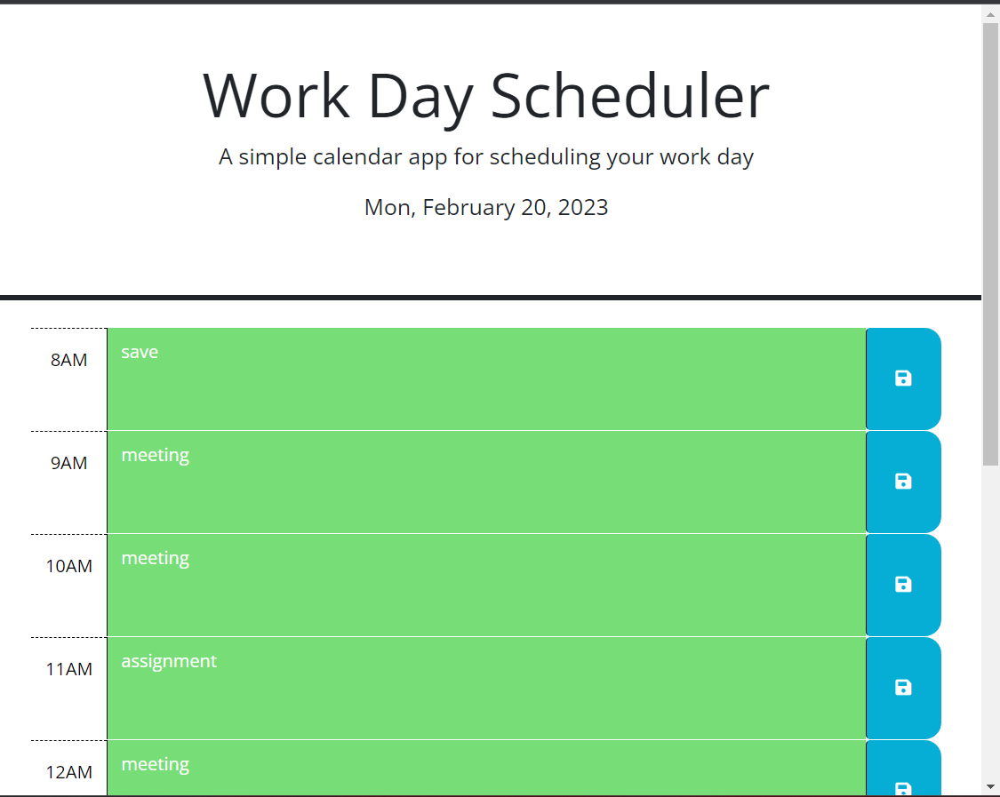
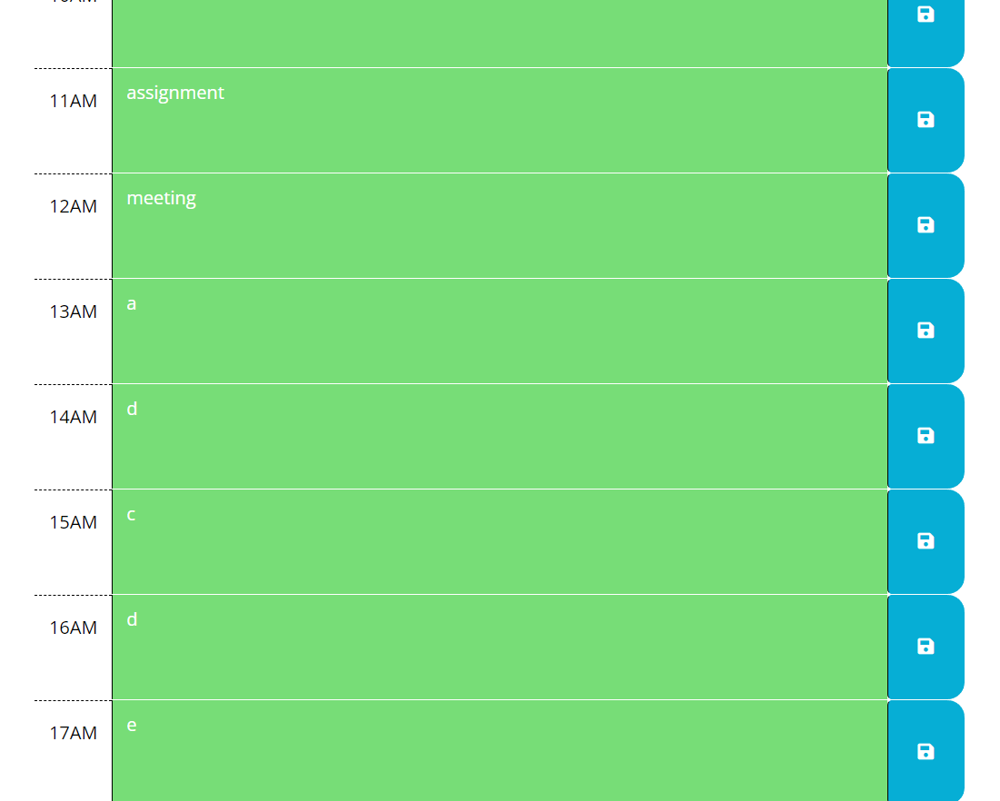

# 05 Third-Party APIs: Work Day Scheduler

## Description
This is a simple calendar application that allows a user to save events for each hour of the day. It will show the hours passed, the hours we are working on, and the working hours we still have on the same day, and these hours will have time blocks with different colors. 
When users take notes in the text area representing the hour they want to work, the messages will be saved in the local storage, so if the users reload the page, the notes will exist. 

## links

The URL of the functional, deployed application:
https://jiasisi.github.io/week5-challenge_work_day_scheduler/

The URL of the GitHub repository:
https://github.com/Jiasisi/week5-challenge_work_day_scheduler

## Screenshots

